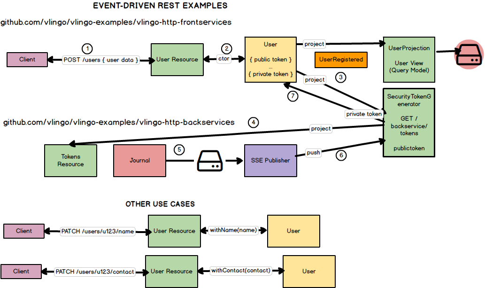

# vlingo-http-frontservice

This is an example service that manages users with profiles. This service collaborates with the
`vlingo-http-backservice` to retrieve private tokens for the given user public token.



How the frontservice and back service work together.

You should run the `vlingo-http-backservice` first and then start the `vlingo-http-frontservice`.

Start a console/command window so you can build the `vlingo-http-backservice` and start it by executing the built `jar`:

```
$ mvn clean package
...
$ java -jar target/vlingo-http-backservice-withdeps.jar
```


Following that, in a separate console/command window, build the `vlingo-http-frontservice` as follows, and then execute the `jar`:

```
$ mvn clean package
...
$ java -jar target/vlingo-http-frontservice-withdeps.jar
```

The following is a sample `curl` command (or use Postman) that can be used to create a user on the `vlingo-http-frontservice` and start the process of retrieving the user's private token.

```
$ curl -i -X POST -H "Content-Type: application/json" -d '{"nameData":{"given":"Jane","family":"Doe"},"contactData":{"emailAddress":"jane.doe@vlingo.io","telephoneNumber":"+1 212-555-1212"},"publicSecurityToken":"jfhf90r8re978er88e,ndf!--88dh*"}' http://localhost:8081/users
```

This command responds with a result similar to the following:

```
HTTP/1.1 201 Created
Location: /users/175
Content-Length: 198

{"id":"175","nameData":{"given":"Jane","family":"Doe"},"contactData":{"emailAddress":"jane.doe@vlingo.io","telephoneNumber":"+1 212-555-1212"},"publicSecurityToken":"jfhf90r8re978er88e,ndf!--88dh*"}
```

Note that the result you observe in your own usage may differ. For example, you may see an `id` in the response `Location` header and `JSON` body other than `175`. In case the actual `id` found in your response's `Location` header is different than `175`, execute the HTTP `GET` request seen next, but replace the value `175` with the actual `id` value from the above response.

```
$ curl -i -X GET -H "Content-Type: application/json" http://localhost:8081/users/175
```

This `GET` request responds with a result similar to the following:

```
HTTP/1.1 200 OK
Content-Length: 198

{"id":"175","nameData":{"given":"Jane","family":"Doe"},"contactData":{"emailAddress":"jane.doe@vlingo.io","telephoneNumber":"+1 212-555-1212"},"publicSecurityToken":"jfhf90r8re978er88e,ndf!--88dh*"}
```

Try it yourself.

You can generate random user data using this resource:
http://www.convertcsv.com/generate-test-data.htm
